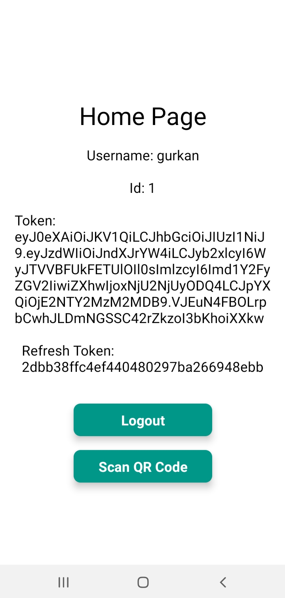
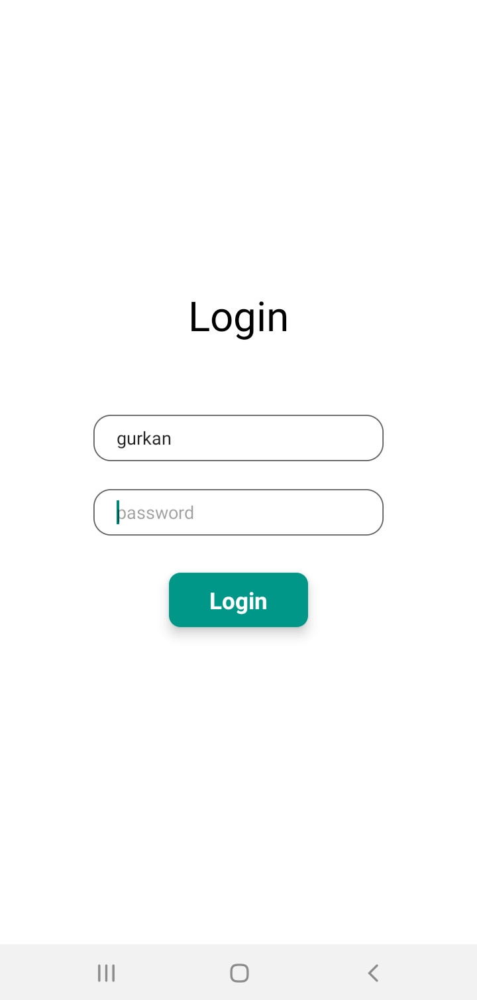
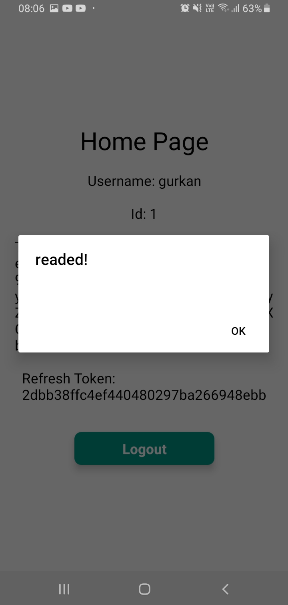

# QR Code Login - Mobile

#### Gurkan UCAR

&nbsp;

### Used Packages

**sockjs-client & stompjs & net:** for connecting to stomp socket

### How to run

#### clone the project: https://github.com/gurkanucar/qr-login-mobile.git

```bash
  git clone https://github.com/gurkanucar/qr-login-mobile.git
  cd qr-login-mobile
```

#### install the packages

```bash
  npm install
```

#### run

```bash
  yarn android
```

#### User credentials for testing

```bash
   username: gurkan
   password: password
```

 ### dont forget to change backend url
 #### /src/constants
 #### export const BASE_URL = "http://[IP ADDRESS]:8080";

## Example Images



